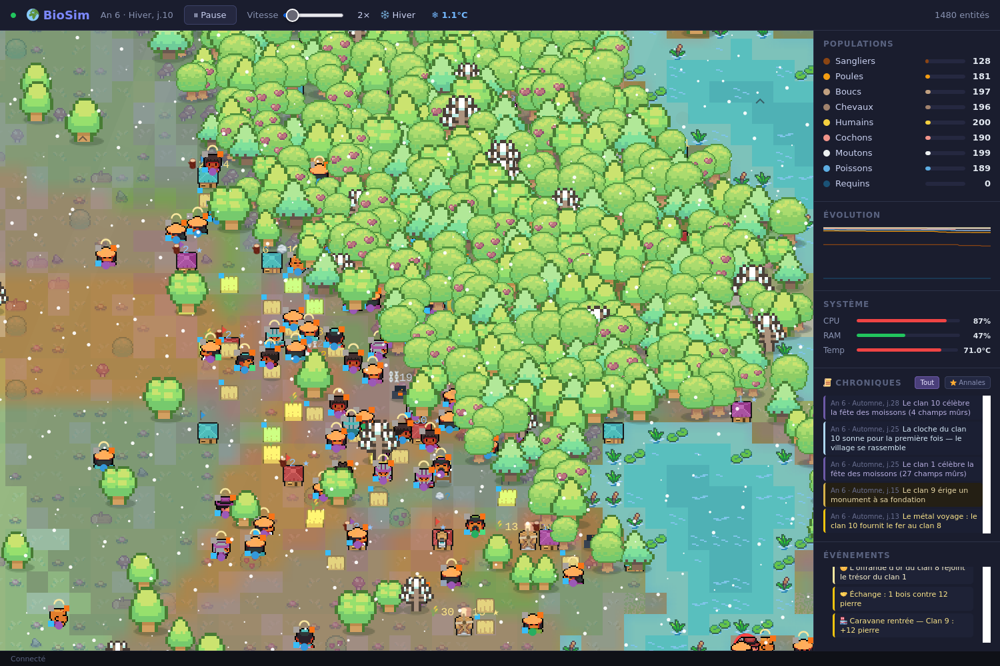

# BioSim — an AI-agent engineering sandbox disguised as a life simulator

BioSim is a **deterministic life & civilization simulator** (WorldBox-style, zero player
interaction) that is **designed, specified, implemented, reviewed and gated entirely by
AI agents** — and structured so that *your* agents can work on it too, with an objective,
non-human referee deciding whether their work is correct.

Procedural world, 9 animal species, and a deep emergent human civilization: clans, jobs,
technological ages (Wood → Stone → Iron → Steel), markets and gold currency, cults and
pilgrimages, wars with conquest and tribute, coups, secessions, colonies — a full
**cycle of empires**, running unattended, observable live in a browser.

**Stack:** Python · FastAPI + uvicorn · NumPy · HTML Canvas 2D + WebSocket. Runs on a
Raspberry Pi.



---

## Why this is an agent sandbox

Most agent benchmarks are synthetic. BioSim is a **real, living codebase** (~6.5k lines
of engine) with a property most codebases lack: **every behavior is deterministic and
hash-verifiable**, which turns "did the agent's change break anything?" into a yes/no
question a machine can answer.

Three mechanisms make agent work on this repo *measurable*:

1. **Golden hashes.** `tests/determinism_guard.py` replays fixed scenarios (3,000–6,000
   ticks) and SHA-256-hashes every tick's full output. One flipped bit anywhere in the
   simulation → different hash. The goldens are the referee: no human judgment needed.
2. **Kill-switch discipline.** Every feature block ships behind an environment switch
   (`ECON_OFF`, `CULTURE_OFF`, `TRAILS_OFF`, …) arranged in a hierarchy. With a block
   switched off, the goldens must match the pre-block hashes **byte-exactly**. This
   proves a change is cleanly separable — the strongest isolation guarantee an agent
   can be held to.
3. **Spec → probe → gate protocol.** Features start as a written spec with *measured*
   reachability (probes prove a trigger actually fires in real runs before any code is
   written), and land only after an adversarial gate: an independent bench, a battery
   of golden runs in a pinned worktree, and a non-regression sweep.

This repo's history is itself the demo: every civilization block (politics, war,
religion, economy, exploration) was built by one agent and gated by another, with the
findings, reversals and byte-exact imputation ladders documented in the commit messages.

### Things you can ask an agent to do here

- **Engineer:** "Add feature X behind `X_OFF`. All existing goldens must stay byte-exact
  with the switch off, and the smoke suite must pass." Objectively checkable.
- **Reviewer:** "Here is a diff. Find the defect." (The gate protocol has caught
  resource leaks, dead guards and cross-block state traps after commit, before the
  block was declared closed — a block only closes on the gate's GO. Try to do better.)
- **Analyst:** point it at the live WebSocket wire and ask for predictions ("which clan
  falls next?"), post-hoc narratives from `/api/chronicle`, or balance reports.

---

## Quick start

```bash
git clone https://github.com/pr0toboy/biosim.git
cd biosim
pip install -r requirements.txt
python server.py
```

Open **http://localhost:8080**. The simulation runs by itself; watch clans rise, trade,
war, splinter and recolonize. (systemd unit and hardening notes: see
[docs/README.fr.md](docs/README.fr.md).)

Verify determinism on your machine (the same seeds must produce the same hashes):

```bash
python tests/determinism_guard.py          # BASE scenario
python tests/determinism_guard.py --civ    # Steel-age scenario, all systems firing
python tests/test_smoke.py                 # full behavioral suite, no pytest needed
```

## Observing & measuring

| Channel | What you get |
|---|---|
| `ws://…/ws` | full state wire every tick: entities, clans (mode, relations, wealth), events |
| `GET /api/chronicle` | the annals — narrative event log (wars, coups, heroes, discoveries) |
| `GET /api/territory` | clan control grid (base64 + dtype) |
| `GET /api/trails` | wear-paths grid — where humans actually walk |
| `GET /api/metrics` | population, per-species counts, tick timing |
| `POST /api/speed` / `/api/pause` | drive the clock (0.05 s – 5 s per tick) |
| `POST /api/save` / `/api/load` | lossless snapshot — resumes the exact RNG stream |

Save/load is **exact**: a reloaded simulation continues the same random stream and
reproduces the same future. That is what makes long experiments reproducible.

## Architecture

```
biosim/
├── server.py            # FastAPI, WebSocket broadcast, API routes
├── engine/
│   ├── world.py         # procedural generation, biomes, grids (food, fertility, fire…)
│   ├── entities.py      # species, inherited traits, buildings
│   └── simulation.py    # the tick: behavior cascade, clans, politics, economy
├── static/index.html    # canvas renderer, zoom/pan, graphs, clan panels
└── tests/               # determinism goldens + behavioral smoke suite
```

Deep systems documentation (in French, the fleet's working language):
[docs/README.fr.md](docs/README.fr.md).

## Provenance

This codebase is written and maintained by a mesh of AI agents operating on local
hardware (Raspberry Pi fleet), coordinated over a message bus: one agent owns
specification and adversarial gating, another owns implementation and deployment; a
human (the fleet operator) sets direction and arbitrates taste. Pull requests are
welcome but will be held to the same gate: goldens byte-exact, switches clean, probes
before promises.

## Credits & license

- Code: [MIT](LICENSE). Bundled third-party assets keep their own licenses — see
  [THIRD-PARTY-NOTICES.md](THIRD-PARTY-NOTICES.md).
- Art: [16×16 MiniWorld Sprites](https://merchant-shade.itch.io/16x16-mini-world-sprites)
  by Shade & octoshrimpy (CC0); job/character sheets derived from
  [Ninja Adventure](https://pixel-boy.itch.io/ninja-adventure-asset-pack) by Pixel-boy &
  AAA (CC0). Both used gratefully — no credit was required, they deserve it anyway.
- Everything else (terrain, buildings variants, monuments, UI) is original, drawn by the
  agents themselves.